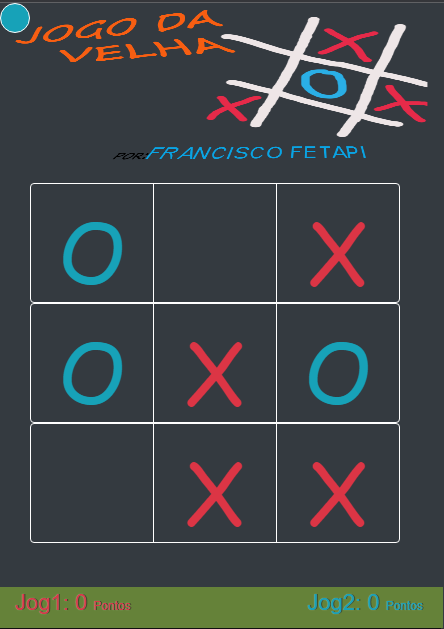

# Jogo Da Velha

Este projeto foi criado em `maio de 2020`, numa época em que eu estava a dar os meus primeiros passos no **mundo do desenvolvimento**. A minha motivação ao fazer esse projeto surgiu depois de eu ter assistido um video onde o **Bill Gates** diz ter criado um **Jogo Da Velha** no inicio da sua jornada como _Programador_.

##

<a href="https://francisco-fetapi.github.io/jogo-da-velha-html-css-js/">Clique aqui se desejas ver o projeto rodando<a/>
